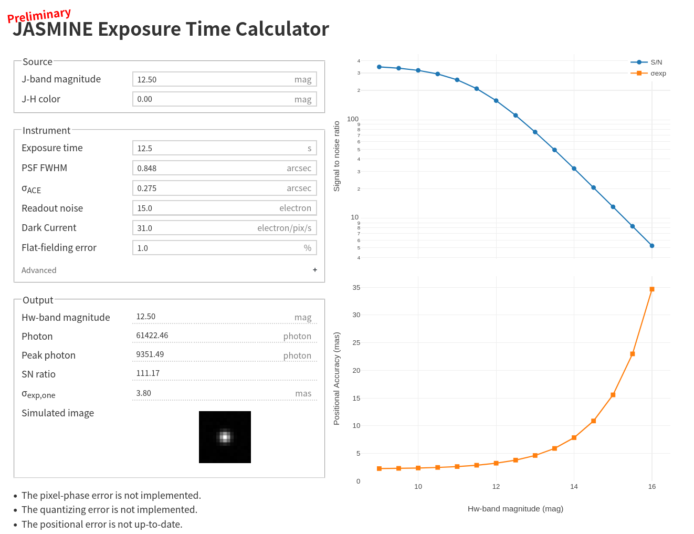

# JASMINE ETC
[](https://github.com/JASMINE-Mission/jasmine-etc/actions/workflows/pages/pages-build-deployment)

A preliminary Exposure Time Calculator for JASMINE.



[etc]: https://jasmine-mission.github.io/jasmine-etc/

## Quick Start

- Open the published page: https://jasmine-mission.github.io/jasmine-etc/
- Or run locally (requires Node.js):

  ```bash
  node scripts/serve.js
  # then open http://localhost:8080/ (defaults to /etc/index.html)
  ```

## Overview

- Static, CDN-based web app (no build step) using:
  - Vue 2 (Options API) for UI state
  - Plotly for graphs (S/N and positional accuracy vs magnitude)
  - A small, framework-free core module for physics/calculations
- The app is preliminary and parameters/coefficients are subject to change.

## Core Module (ETCCore)

- Location: `etc/js/core.js`
- Format: UMD (browser global `window.ETCCore`, Node `module.exports`)
- Contains pure functions that implement the physics model used by the UI.

Examples:

```js
// Browser (CDN Vue/Plotly, local ETCCore):
// <script src="js/core.js"></script>
const Hw = ETCCore.hwFromJ(J, JH);
const params = ETCCore.defaultParams();
const snr = ETCCore.get_SNR(Hw, params);
```

```js
// Node (tests/scripts):
const core = require('./etc/js/core.js');
const p = core.defaultParams();
const Hw = core.hwFromJ(p.J, p.JH);
console.log(core.get_SNR(Hw, p));
```

Key functions (selection): `hwFromJ`, `throughput`, `pixelScale`, `totalSigma`, `get_flux`,
`get_photon_array`, `get_total_photon`, `get_noise`, `get_SNR`, `get_sigexp`, `peak_photon`.

## UI Notes

- The UI delegates all physics calculations to `ETCCore`.
- Advanced panel includes additional controls:
  - Backgrounds, transmittances, detector QE, ADC bits
  - Magnitude range for the graph (Hw x-axis):
    - Min slider: [5, 12], step 0.1
    - Max slider: [13, 20], step 0.1
    - Step input: sampling step in mag (default 0.5, capped to ≤60 points)
- Simulated PSF image is drawn on a 15×15 canvas grid with optional asinh scaling on hover.

## Tests

- Minimal Node-based test harness (no external runner):

  ```bash
  node tests/run-tests.js
  ```

- What it checks (examples):
  - Pixel scale sanity
  - SNR increases with exposure time
  - σexp decreases with exposure time
  - Peak photon increases for sharper PSF
  - Total photon increases with throughput
  - Photon array sum does not exceed the ideal total photons

## Local Development

- Files of interest:
  - `etc/index.html` — main page
  - `etc/css/main.css` — styles (including custom square sliders under Advanced)
  - `etc/js/jasmine-etc.js` — UI glue, rendering, and Plotly integration
  - `etc/js/core.js` — pure calculation module (ETCCore)
  - `scripts/serve.js` — tiny static server for local checks
  - `tests/` — simple Node tests for core functions

## License

MIT — see `LICENSE`.
